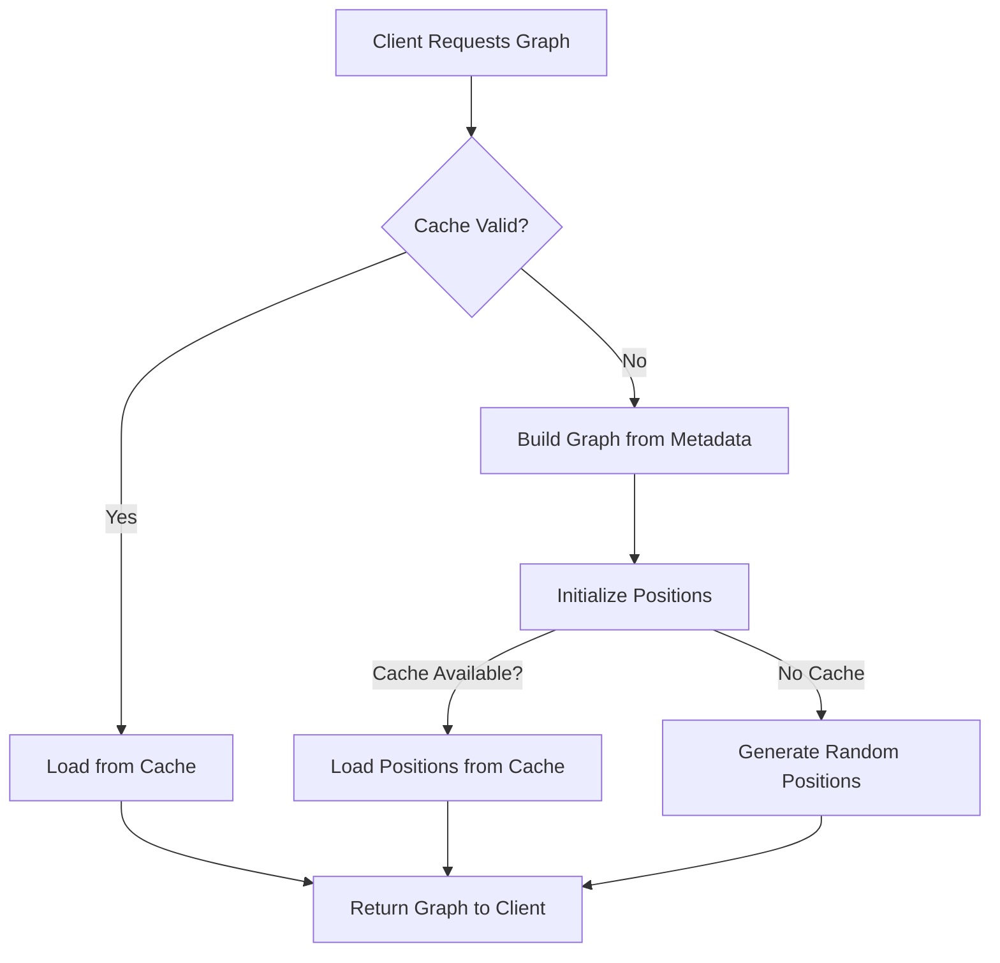

# Application Initialization Process

This document describes the initialization process of the application, which has been optimized for speed and efficiency through lazy loading techniques.

## Overview

The application initialization has been restructured to be non-blocking and to defer expensive operations until they're actually needed. This significantly improves startup time and responsiveness.

## Initialization Sequence

1. **Settings Loading**: The first step is loading settings from the configuration file
2. **Logging Setup**: Configure logging based on settings
3. **GitHub Client Initialization**: Initialize the GitHub client for content access
4. **App State Creation**: Create the application state with minimal initial services
5. **Metadata Loading**: Load existing metadata from cache (without processing files)
6. **Lazy Graph Initialization**: Defer graph building until it's requested by a client
7. **HTTP Server Start**: Begin accepting connections

## Lazy Loading Implementation

### Graph Service

The GraphService now implements a lazy initialization pattern:

- No graph is built during server startup
- The graph is created only when requested by a client
- When requested, it first attempts to load from cache
- Only if the cache is invalid or missing, the full graph is rebuilt
- Position layout caching preserves node positions between sessions

### GraphService Initialization Flow

### Metadata Processing

- Metadata is loaded during startup, but file processing is deferred
- SHA1 hash validation ensures only changed files are reprocessed
- Individual file metadata is stored separately for incremental updates

## Benefits

1. **Faster Startup**: The server starts much more quickly
2. **Immediate Responsiveness**: The server can handle requests immediately
3. **Resource Efficiency**: Resources are only used when needed
4. **Consistent Experience**: Caching preserves user context between sessions

## Important Notes for Developers

- First client graph request may take longer than subsequent requests
- When making code changes that affect graph building, ensure the cache invalidation logic is updated
- The GraphService will handle cache loading failures gracefully, falling back to full rebuilds
- The position caching system automatically updates when the graph changes

## Configuration

Caching behavior can be adjusted through the following settings:

- Cache paths are defined in `src/services/file_service.rs` as constants
- The physics simulation parameters are still configurable in settings.yaml