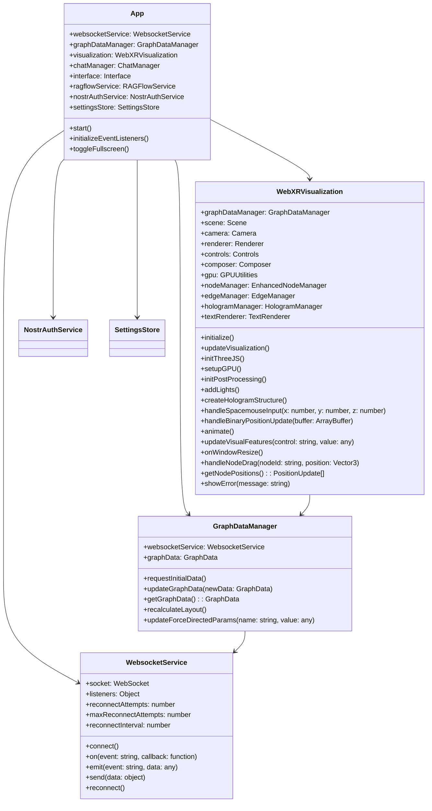
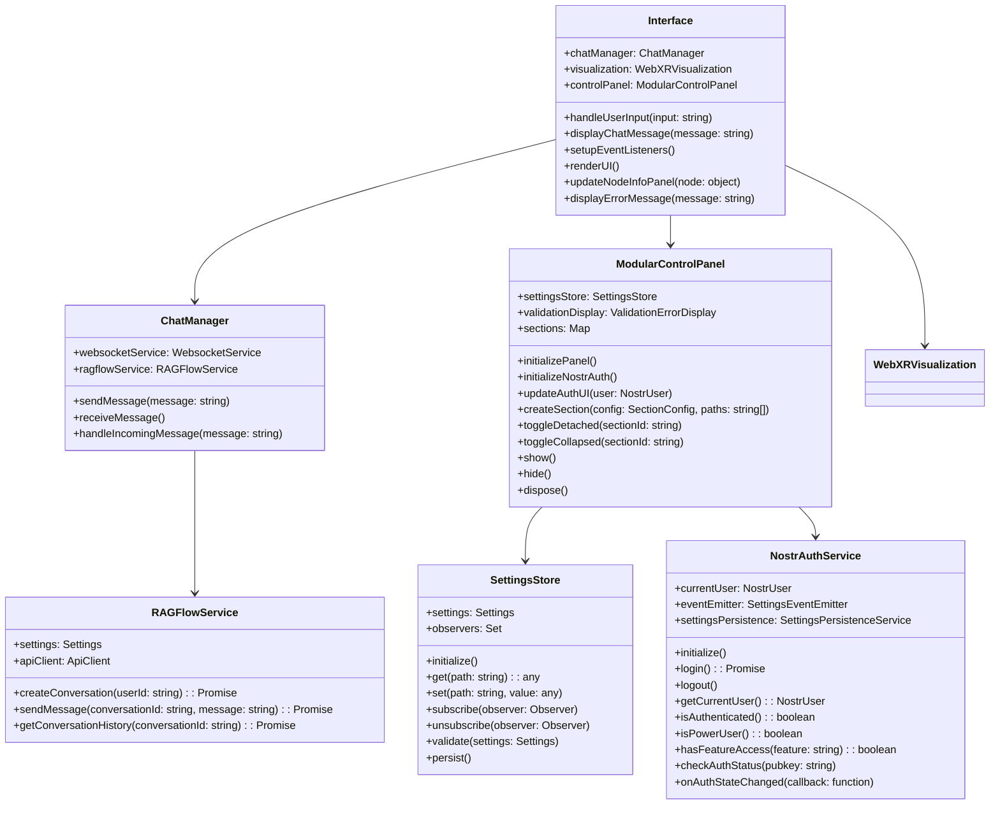
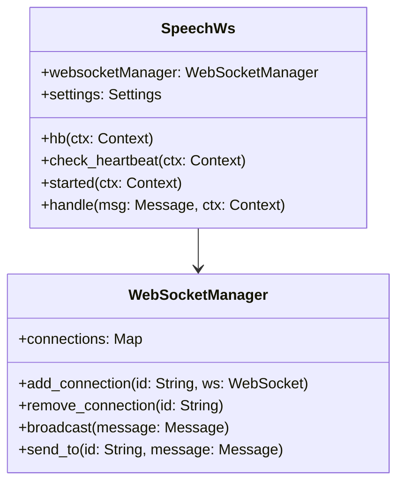

# Class Diagrams

This document provides detailed class diagrams and relationships for the major components of LogseqXR.

## Core Application Structure

## Backend Services

```mermaid
classDiagram
    class GraphService {
        +build_graph(app_state: AppState): Result<GraphData, Error>
        +calculate_layout(gpu_compute: GPUCompute, graph: GraphData, params: SimulationParams): Result<void, Error>
        +initialize_random_positions(graph: GraphData)
    }
    class PerplexityService {
        +process_file(file: ProcessedFile, settings: Settings, api_client: ApiClient): Result<ProcessedFile, Error>
    }
    class FileService {
        +fetch_and_process_files(github_service: GitHubService, settings: Settings, metadata_map: Map<String, Metadata>): Result<Vec<ProcessedFile>, Error>
        +load_or_create_metadata(): Result<Map<String, Metadata>, Error>
        +save_metadata(metadata: Map<String, Metadata>): Result<void, Error>
        +calculate_node_size(file_size: number): number
        +extract_references(content: string, valid_nodes: String[]): Map<String, ReferenceInfo>
        +convert_references_to_topic_counts(references: Map<String, ReferenceInfo>): Map<String, number>
        +initialize_local_storage(github_service: GitHubService, settings: Settings): Result<void, Error>
        +count_hyperlinks(content: string): number
    }
    class NostrService {
        +settings: Settings
        +validate_session(pubkey: str, token: str): bool
        +get_user(pubkey: str): Option<NostrUser>
        +update_user_api_keys(pubkey: str, api_keys: ApiKeys): Result<NostrUser>
    }
    class GitHubService {
        +fetch_file_metadata(): Result<Vec<GithubFileMetadata>, Error>
        +get_download_url(file_name: string): Result<string, Error>
        +fetch_file_content(download_url: string): Result<string, Error>
        +get_file_last_modified(file_path: string): Result<Date, Error>
    }
    class GitHubPRService {
        +create_pull_request(file_name: string, content: string, original_sha: string): Result<string, Error>
    }
    class ApiClient {
        +post_json(url: string, body: PerplexityRequest, perplexity_api_key: string): Result<string, Error>
    }
    class SpeechService {
        +websocketManager: WebSocketManager
        +settings: Settings
        +start(receiver: Receiver<SpeechCommand>)
        +initialize(): Result<void, Error>
        +send_message(message: string): Result<void, Error>
        +close(): Result<void, Error>
        +set_tts_provider(use_openai: boolean): Result<void, Error>
    }

    GraphService --> GPUCompute
    PerplexityService --> ApiClient
    FileService --> GitHubService
    GitHubPRService --> GitHubService
    SpeechService --> WebSocketManager
```

## Frontend Components

## WebSocket Components

## Key Relationships

- The `App` class serves as the main entry point and coordinates all major components
- `WebsocketService` handles real-time communication between frontend and backend
- `GraphDataManager` manages the graph data structure and coordinates with the visualization
- `WebXRVisualization` handles the 3D rendering and XR interactions
- `ModularControlPanel` provides a flexible UI with dockable sections and Nostr authentication
- `NostrAuthService` manages user authentication and feature access
- `SettingsStore` provides centralized settings management
- Backend services are organized around specific responsibilities (files, graph, AI, auth, etc.)
- Frontend components handle user interaction and visualization updates

## Related Documentation
- [Technical Architecture](../overview/architecture.md)
- [Development Setup](../development/setup.md)
- [API Documentation](../api/rest.md)