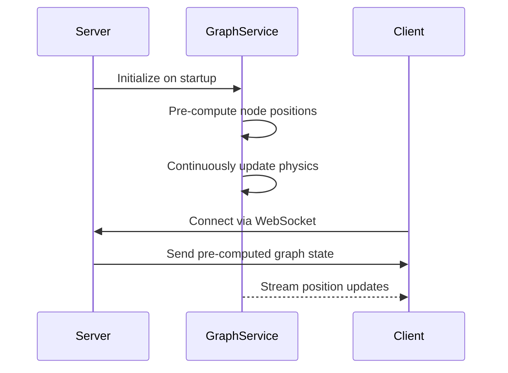
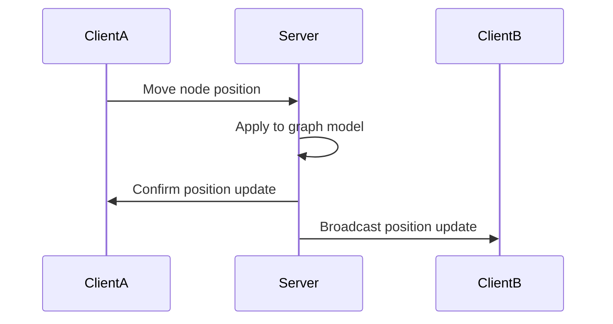

# Decoupled Graph Architecture

## Overview

The LogseqXR graph architecture has been modernized to decouple graph initialization and physics processing from client connections. This document outlines the new architecture and explains the key components and their interactions.

## Architecture Components

### Server-Side Components

- **GraphService**: Continuously maintains the force-directed graph independently of client connections
- **ClientManager**: Tracks all connected WebSocket clients and handles broadcasting updates
- **Force-Directed Physics**: Pre-computes node positioning with server-side physics processing
- **WebSocket Handler**: Manages bi-directional communication for synchronized graph state

### Client-Side Components

- **WebSocketService**: Handles WebSocket communication with the server
- **NodeManager**: Processes incoming node position updates and sends user interactions back to server
- **GraphRenderer**: Visualizes the graph with updated node positions

## Key Architectural Improvements

### 1. Independent Graph Initialization

The graph is now initialized once at server startup, regardless of client connections. Key benefits:

- Reduced resource utilization by avoiding redundant graph creation
- Consistent graph state across all clients
- Immediate graph availability for new client connections

### 2. Continuous Force-Directed Layout

The server now maintains a continuous physics simulation:

- Graph nodes find optimal positions before any client connects
- Reduced initial loading time for clients as layout is pre-calculated
- Physics simulation stabilizes over time, creating a more balanced visualization

### 3. Bidirectional Synchronization

The new architecture supports true bidirectional updates:

- Server broadcasts position updates to all connected clients
- Any client can update node positions (e.g., during user interaction)
- All changes are synchronized across all clients in real-time
- Server maintains position authority for consistency

### 4. Optimized Data Transfer

The system includes several optimizations:

- Selective updates: Only nodes that change significantly trigger updates
- Position deadbanding: Filters out minor position changes
- Automatic compression for larger messages
- Dynamic update rate based on graph activity level

## Implementation Details

### Server-Side Physics Processing

The server uses a hybrid approach to physics processing:

1. GPU-accelerated computing when available (CUDA/WebGPU)
2. CPU fallback for environments without GPU support
3. Physics parameters tuned for stability and performance

### Client Connection Lifecycle

When a client connects:
1. The server sends the complete, settled graph state (metadata, node positions, edge data)
2. The client renders the initial state
3. The server begins streaming position updates
4. The client can send position updates to the server
5. The server broadcasts these changes to all other clients

## Performance Benefits

- **Reduced CPU/GPU usage**: Physics calculations shared across all clients
- **Lower bandwidth usage**: Only changed positions are transmitted
- **Faster initialization**: Clients receive pre-computed positions
- **Better scalability**: Multiple clients supported with minimal additional resource usage

## Future Improvements

- Real-time collaborative editing of graph content
- Conflict resolution for simultaneous node edits
- Region-based updates for very large graphs
- Client-specific view customizations