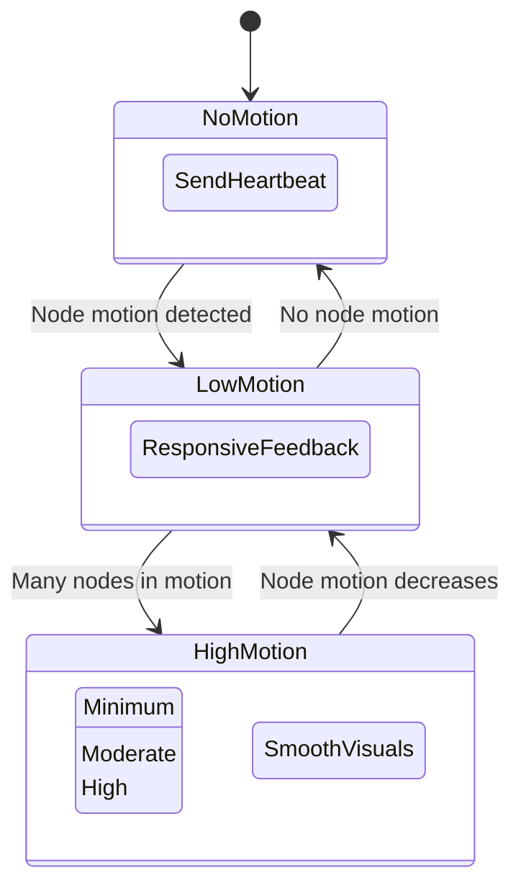

# Dynamic Update Rate Optimization

## Problem Statement

The force-directed graph visualization relies on WebSocket connections to send real-time position updates from the server to client. The current implementation uses a fixed update rate which has several drawbacks:

1. During periods of high motion (when the graph is rebalancing), a fixed rate may not provide enough updates to ensure smooth visualization
2. During periods of low/no motion, the system continues to send updates at the same rate, consuming unnecessary bandwidth and resources
3. After user interaction with 1-2 nodes, the server responds with full graph rebalancing, but the update rhythm doesn't adapt to this pattern

## Investigation Results

Analyzing the WebSocket traffic between server and client showed:

- Most network traffic occurs in bursts when the graph is initially loaded or after user interactions
- Many WebSocket messages contain position updates for nodes that haven't changed significantly
- Deadband filtering can reduce unnecessary updates, but doesn't solve the temporal pattern issue
- The client uses requestAnimationFrame for rendering, which is limited to the display refresh rate

## Solution Design: Dynamic Update Rates

After considering batching vs. dynamic rates, we determined that **dynamic update rates** are better suited for a force-directed graph system. Here's why:

- When the graph is actively rebalancing, we need frequent updates to ensure visual smoothness
- When nodes are stable, we can reduce update frequency substantially, saving resources
- A dynamic rate approach can adapt to the natural flow of force-directed graph motion

### Design Diagram



## Implementation Details

### Configuration Parameters

Added to settings.yaml under system.websocket:

```yaml
min_update_rate: 5      # Minimum updates per second when graph is stable
max_update_rate: 60     # Maximum updates per second during high motion
motion_threshold: 0.05  # Consider graph in motion if at least 5% of nodes are moving
motion_damping: 0.9     # Damping factor for rate changes (higher = smoother transitions)
```

### Server-Side Changes

1. **Configuration Structure**
   - Added parameters to WebSocketSettings struct in the config module
   - Established default values for cases where settings are unavailable

2. **SocketFlowServer Changes**
   - Added new fields to track motion state:
     - `current_update_rate`: Dynamically adjusted rate based on motion
     - `nodes_in_motion`: Count of nodes currently changing position/velocity
     - `total_node_count`: Total number of nodes for percentage calculation
   - Implemented helper methods:
     - `calculate_motion_percentage()`: Returns the percentage of nodes in motion
     - `update_dynamic_rate()`: Adjusts the rate based on current motion level
     - `get_current_update_interval()`: Converts rate to a time duration

3. **Dynamic Update Scheduling**
   - Replaced fixed interval updates with dynamic scheduling
   - Initial updates start immediately with max rate
   - Each subsequent update is scheduled based on the calculated rate
   - The system transitions smoothly between rates using damping

### Motion Detection Algorithm

1. Calculate the percentage of nodes currently in motion
2. If ≥ threshold%, use maximum update rate
3. If < threshold%, scale rate between min and max based on percentage
4. Apply damping to smooth rate transitions
5. Clamp final rate between min and max values

## Implementation Status

As of now, we have:

- [x] Added configuration parameters to settings.yaml
- [x] Updated WebSocketSettings struct in config/mod.rs
- [x] Added new fields to SocketFlowServer
- [x] Implemented dynamic rate calculation methods
- [ ] Complete replacement of fixed intervals with dynamic scheduling
- [ ] Add client-side notification about dynamic rate status
- [ ] Implement proper error handling for rate transitions

## Projected Benefits

1. **Performance**: Reduced server CPU and network usage during periods of inactivity
2. **Visual Quality**: Higher update rates during active movements for smoother visualization
3. **Responsiveness**: Quick adaptation to user interactions and graph rebalancing
4. **Resource Efficiency**: Automatic scaling of resources based on actual needs

## Next Steps

1. Complete the implementation of dynamic scheduling in socket_flow_handler.rs
2. Add client-side logging to monitor update rate adaptation
3. Implement proper client-side throttling that accounts for varying server rates
4. Conduct performance testing to validate benefits and fine-tune parameters