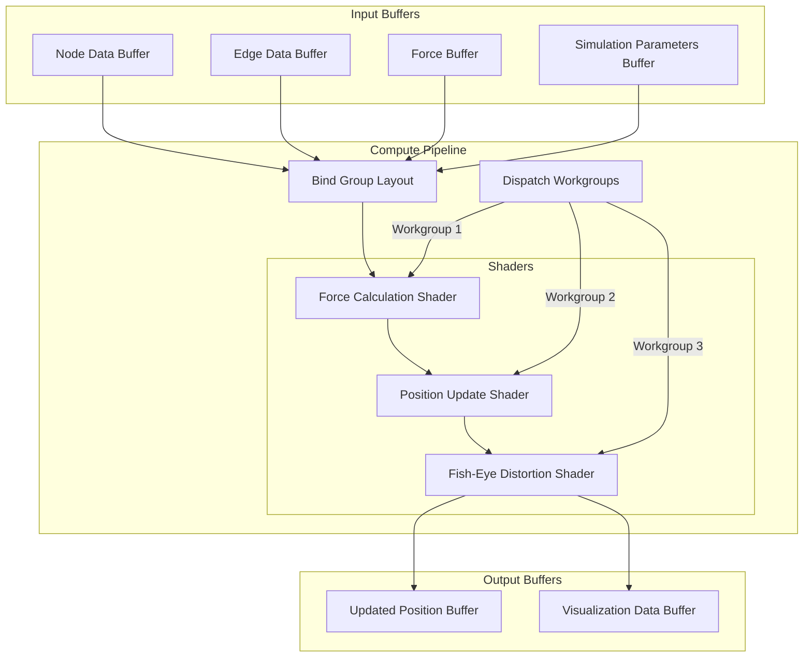

# WebGPU Compute Pipeline

The WebGPU compute pipeline is a crucial component of LogseqXR, enabling high-performance force-directed layout calculations and advanced visual effects.

## Pipeline Architecture



## Component Details

### Input Buffers

1. **Node Data Buffer**
   - Contains data for each node in the graph
   - Structure includes position, velocity, and mass
   - Updated through WebSocket messages

2. **Edge Data Buffer**
   - Contains data for graph edges
   - Includes source and target node IDs
   - Stores edge weights and properties

3. **Force Buffer**
   - Temporary storage for calculated forces
   - Reset between computation cycles
   - Used for force accumulation

4. **Simulation Parameters Buffer**
   - Contains physics simulation parameters
   - Includes spring strength, repulsion, damping
   - Dynamically updatable during runtime

### Compute Pipeline

#### Bind Group Layout
- Defines the layout of input and output buffers
- Specifies buffer access patterns
- Optimizes GPU memory access

#### Shaders

1. **Force Calculation Shader**
   ```wgsl
   @compute @workgroup_size(256)
   fn calculate_forces(
       @builtin(global_invocation_id) global_id: vec3<u32>
   ) {
       // Node index
       let node_idx = global_id.x;
       
       // Load node data
       let node = nodes[node_idx];
       var total_force = vec3<f32>(0.0);
       
       // Calculate repulsive forces
       for (var i = 0u; i < arrayLength(&nodes); i++) {
           if (i != node_idx) {
               let other = nodes[i];
               total_force += calculate_repulsion(node.position, other.position);
           }
       }
       
       // Calculate spring forces from edges
       for (var i = 0u; i < arrayLength(&edges); i++) {
           let edge = edges[i];
           if (edge.source == node_idx || edge.target == node_idx) {
               total_force += calculate_spring_force(edge, node_idx);
           }
       }
       
       // Store result
       forces[node_idx] = total_force;
   }
   ```

2. **Position Update Shader**
   ```wgsl
   @compute @workgroup_size(256)
   fn update_positions(
       @builtin(global_invocation_id) global_id: vec3<u32>
   ) {
       let node_idx = global_id.x;
       let force = forces[node_idx];
       let params = simulation_params.physics;
       
       // Update velocity with damping
       var node = nodes[node_idx];
       node.velocity = node.velocity * params.damping + force * params.dt;
       
       // Update position
       node.position = node.position + node.velocity * params.dt;
       
       // Store updated node
       nodes[node_idx] = node;
   }
   ```

3. **Fisheye Effect Shader**
   ```wgsl
   @compute @workgroup_size(256)
   fn apply_fisheye(
       @builtin(global_invocation_id) global_id: vec3<u32>
   ) {
       let node_idx = global_id.x;
       let node = nodes[node_idx];
       let params = visualization_params.fisheye;
       
       // Calculate distortion
       let dist = distance(node.position, params.focus_point);
       let factor = 1.0 / (1.0 + dist * params.distortion_strength);
       
       // Apply distortion
       let distorted_pos = mix(
           node.position,
           params.focus_point,
           factor
       );
       
       // Store result
       visualization_data[node_idx].position = distorted_pos;
   }
   ```

### Output Buffers

1. **Updated Position Buffer**
   - Contains final node positions
   - Used for rendering and state updates
   - Synchronized with client state

2. **Visualization Data Buffer**
   - Stores processed visualization data
   - Includes distortion effects
   - Used by Three.js for rendering

## Performance Benefits

### 1. Parallel Processing
- Compute shaders execute in parallel across multiple workgroups
- Each node's forces calculated independently
- Efficient utilization of GPU cores

### 2. Memory Efficiency
- Structured buffer layout minimizes memory transfers
- In-place updates reduce memory allocation
- Coalesced memory access patterns

### 3. Scalability
- Handles large graphs with thousands of nodes
- Performance scales with GPU capability
- Automatic workgroup size optimization

### 4. Real-time Updates
- Fast enough for 60+ FPS updates
- Smooth animation of graph changes
- Responsive user interactions

## CPU Fallback

When WebGPU is not available, the system falls back to CPU-based computation:

```typescript
class CPUComputeService implements ComputeService {
    calculateForces(nodes: Node[], edges: Edge[]): void {
        // Sequential force calculation
        for (const node of nodes) {
            let force = new Vector3();
            
            // Calculate forces
            for (const other of nodes) {
                if (node !== other) {
                    force.add(calculateRepulsion(node, other));
                }
            }
            
            // Apply forces
            node.force.copy(force);
        }
    }
    
    updatePositions(nodes: Node[], dt: number): void {
        for (const node of nodes) {
            // Update velocity and position
            node.velocity.add(node.force.multiplyScalar(dt));
            node.position.add(node.velocity.multiplyScalar(dt));
        }
    }
}
```

For more information about performance optimizations and benchmarks, see [Performance Optimizations](./performance.md).